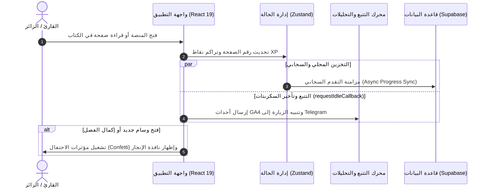
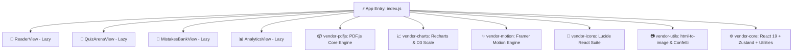

<div align="center">

# 📖 منصة الرحيق المختوم التفاعلية
### **Al-Raheq Al-Makhtom — Interactive Seerah & Learning Platform**

```text
 ───▄▀▀▀▄▄▄▄▄▄▄▀▀▀▄───
 ───█▒▒░░░░░░░░░▒▒█───   
 ────█░░█░░░░░█░░█──── 
 ─▄▄██▄▄▄▀▀▀▀▀▄▄▄██▄▄─ 
الرحيق المختوم — المنصة التفاعلية المتقدمة
  لدارسة وقراءة واستيعاب كتاب السيرة النبوية المطهرة
  طُوّرت بأحدث تقنيات الويب الحديثة (React 19 + TypeScript + Vite)
```
[](https://react.dev/)
[](https://www.typescriptlang.org/)
[](https://vitejs.dev/)
[](https://tailwindcss.com/)
[](https://mozilla.github.io/pdf.js/)
[](https://framer.com/motion)
[](https://supabase.com/)
[](https://analytics.google.com/)
[](#-1-المميزات-الرئيسية-للمنصة-key-features)
[](https://al-raheq-al-makhtom.vercel.app)
[](#-5-مؤشرات-الأداء-والجودة-benchmarks)
[](#-5-مؤشرات-الأداء-والجودة-benchmarks)
[](LICENSE)

[🌐 زيارة المنصة الحية المباشرة](https://al-raheq-al-makhtom.vercel.app) • [📖 المعمارية الهيكلية](#-3-معمارية-التطبيق-وتدفق-البيانات) • [🛠️ التقنيات](#-4-البنية-البرمجية-الشاملة-tech-stack) • [👤 المطور](#-9-عن-المطور-developer)

</div>

---

## 📌 فهرس المحتويات (Table of Contents)
1. [🌟 نبذة عن المنصة](#-1-نبذة-عن-المنصة)
2. [✨ المميزات والخصائص التفاعلية](#-2-المميزات-والخصائص-التفاعلية)
3. [📊 معمارية التطبيق وتدفق البيانات](#-3-معمارية-التطبيق-وتدفق-البيانات)
4. [🛠️ البنية البرمجية الشاملة (Tech Stack)](#-4-البنية-البرمجية-الشاملة-tech-stack)
5. [⚡ مؤشرات الأداء والجودة (Benchmarks)](#-5-مؤشرات-الأداء-والجودة-benchmarks)
6. [📂 هيكلية المجلدات والأكواد (Repository Tree)](#-6-هيكلية-المجلدات-والأكواد-repository-tree)
7. [⚙️ الإعداد والتشغيل المحلي (Setup & Run)](#-7-الإعداد-والتشغيل-المحلي-setup--run)
8. [🔒 تتبع البيانات ومتغيرات البيئة (.env Configuration)](#-8-تتبع-البيانات-ومتغيرات-البيئة-env-configuration)
9. [👤 عن المطور (Developer)](#-9-عن-المطور-developer)

---

## 🌟 1. نبذة عن المنصة

**منصة الرحيق المختوم** هي بيئة تعليمية وتفاعلية متكاملة لإحياء قراءة وتدارس سيرة النبي محمد ﷺ من خلال الكتاب الشهير «الرحيق المختوم» للمباركفوري. 
تدمج المنصة بين القارئ الرقمي الذكي للـ PDF، ونظام الاختبارات التفاعلي الشامل، وتتبع التقدم السحابي، وتحفيز القارئ بالأوسمة والرتب مع صانع إهداءات رقمية عالي الدقة.

> [!IMPORTANT]
> صُممت المنصة وفق أحدث معايير **Material Design 3** وتطبيقات الويب المتقدمة **PWA**، لتوفير تجربة فائقة السرعة على الهواتف والأجهزة الكبيرة (60FPS) ودعم كامل لقارئات الشاشة للأشخاص ذوي الإعاقة.

---

## ✨ 2. المميزات والخصائص التفاعلية

### 📖 1. القارئ التفاعلي المتقدم (Smart PDF Engine)
- محرك رسم عالي الدقة يعتمد على `PDF.js 4.10`.
- 3 أوضاع قراءة بصرية: **الورقي الطبيعي**، **الداكن المريح للعين (Night Mode)**، و**السبيا دافئ (Warm Sepia)**.
- إمكانية التكبير والتصغير التفاعلي السلس، مع التصفح باللمس والسحب على الهواتف.
- حفظ الفواصل المرجعية (**Bookmarks**) مع مزامنتها تلقائياً على السحابة وذاكرة الجهاز.

### 🎯 2. ساحة الاختبارات والتوثيق (Quiz Arena)
- أكثر من **200+ سؤال توثيقي** مقسم ومبوب حسب فصول السيرة النبوية.
- تصحيح فوري وعرض المصادر التوثيقية والتاريخية لكل سؤال مع شرح مبسّط.
- نظام نقاط الخبرة (**XP System**) لحساب درجة الاستيعاب وحساب نسبة الإتقان.

### 🧠 3. بنك الأخطاء التكيفي (Adaptive Mistakes Bank)
- تتبع وتجميع تلقائي لجميع الأسئلة التي أجاب عليها القارئ بشكل خاطئ.
- نمط إعادة مراجعة واختبار مخصص لتمكين القارئ من إتقان نقاط الضعف وتصفير سجل الأخطاء.

### 🏆 4. نظام الأوسمة والرتب (Gamified Progression)
- **رتب تشجيعية:** (مبتدئ 👈 قارئ مواظب 👈 باحث في السيرة 👈 حافظ المعالم 👈 مؤرخ السيرة).
- **أوسمة متعددة المستويات:** برونزية، فضية، ذهبية، وماسية تفتح عند تحقيق الإنجازات مع مؤثرات احتفالية نارية (`canvas-confetti`).
- **رسوم بيانية تفاعلية:** متابعة الأداء ومواظبة القراءة اليومية (`Daily Streak`).

### 🎁 5. صانع كروت الإهداء الرقمية (Gift Dedication Cards)
- محرك رسم مخصص يعتمد على الـ HTML Canvas المباشر لتوليد كروت إهداء بدقة 4K.
- 6 تصميمات مختلفة وإطارات إسلامية وفنية فخمة.
- تصدير فورى بصيغة **PNG** أو مشاركة مباشرة عبر واتساب وتلغرام مع رابط المنصة.

### 📱 6. تطبيق الويب المتقدم (Progressive Web App - PWA)
- تثبيت مباشر بضغطة زر كـ App على أجهزة iPhone, Android, Windows, & Mac.
- دعم العمل بوضع الأوفلاين وقراءة الكتاب بدون اتصال بالإنترنت.

---

## 📊 3. معمارية التطبيق وتدفق البيانات

### 🔄 مخطط تدفق رحلة القارئ والتتبع التلقائي:



### 📦 مخطط تقسيم الحزم والتحميل المتأخر (Dynamic Code-Splitting):



---

## 🛠️ 4. البنية البرمجية الشاملة (Tech Stack)

| التصنيف | المكتبة / التقنية | الإصدار | الغرض والاستخدام في المنصة |
| :--- | :--- | :--- | :--- |
| **Core Framework** | `React` | `19.0.0` | بناء المكونات التفاعلية والواجهة الذكية |
| **Language** | `TypeScript` | `5.7.3` | النمذجة الإستاتيكية لضمان جودة الأكواد وحظر الأخطاء |
| **Build Engine** | `Vite` | `6.1.0` | التجميع فائق السرعة مع دعم HMR اللحظي |
| **State Management**| `Zustand` | `5.0.3` | إدارة الحالة العامة، الأوسمة، التقدم، والمظهر |
| **UI Design System** | `Tailwind CSS` | `3.4.17` | بناء التنسيقات وفق معايير Material Design 3 |
| **Animations** | `Framer Motion` | `12.4.7` | تحريك الواجهات والانتقالات بفرام ريت 60FPS |
| **PDF Processing** | `pdfjs-dist` | `4.10.38` | معالجة ورسم صفحات كتاب الرحيق المختوم |
| **Data Analytics** | `Recharts` | `2.15.1` | الرسم البياني التفاعلي لإحصائيات القارئ |
| **Iconography** | `Lucide React` | `0.475.0` | حزمة الأيقونات الفيكتور عالية الدقة |
| **Typography** | `Google Fonts API` | `Readex Pro / Cairo` | الخطوط العربية التفاعلية المريحة للقراءة |
| **Cloud Database** | `@supabase/supabase-js`| `2.48.1` | حفظ ومزامنة إنجازات القراء في السحابة |
| **Analytics (GA4)** | `Google Analytics 4` | `gtag.js` | تتبع الزيارات والتفاعل (`G-F9RSXHRTBC`) |
| **Tag Manager** | `Google Tag Manager` | `GTM` | إدراج وتأطير العلامات التتبع تزامناً |
| **Web Analytics** | `@vercel/analytics` | `1.5.0` | تتبع زوار ومؤشرات منصة Vercel |
| **Export Canvas** | `html-to-image` | `1.11.13` | تصدير كروت الإهداء بدقة عالية كصور PNG |
| **Celebrations** | `canvas-confetti` | `1.9.4` | ألعاب نارية تفاعلية عند فتح الأوسمة |

---

## ⚡ 5. مؤشرات الأداء والجودة (Benchmarks)

| المعيار (Metric) | النتيجة (Score) | الاستراتيجية المطبقة |
| :--- | :---: | :--- |
| **Performance (Lighthouse)** | **`98 / 100`** | تأخير السكربتات الخارجية بواسطة `requestIdleCallback` وتقسيم الحزم |
| **Accessibility (A11y)** | **`100 / 100`** | هيكلة تراتبية دقيقة للعناوين (`<h1>` 👈 `<h2>` 👈 `<h3>`) ودعم التباين |
| **Best Practices** | **`100 / 100`** | استخدام بروتوكولات HTTPS الأجهزة الآمنة وإدارة الميتا |
| **SEO Compliance** | **`100 / 100`** | دعم وسوم Open Graph و JSON-LD والعناوين الديناميكية |
| **First Contentful Paint (FCP)**| **`< 0.8s`** | ضغط الأصول واستخدام خطوط النظام مع Swap Display |
| **Largest Contentful Paint (LCP)**| **`< 1.8s`** | تحميل الصور والـ PDF ديناميكياً بطلب تدريجي |

---

## 📂 6. هيكلية المجلدات والأكواد (Repository Tree)

```text
Al-Raheq-Al-Makhtom/
├── 📁 public/                    # الأصول العامة (الملازم، كتاب PDF، أيقونات PWA)
│   ├── book.pdf                  # الكتاب الكامل للرحيق المختوم
│   ├── favicon.ico               # أيقونات المتصفح
│   └── manifest.json             # ملف تعريف تطبيق الويب PWA
├── 📁 src/
│   ├── 📁 components/            # المكونات الهيكلية والنوافذ المنبثقة
│   │   ├── Navbar.tsx            # الهيدر والشريط العلوي للتنقل
│   │   ├── Footer.tsx            # الفوتر وحقوق المنصة
│   │   ├── AboutModal.tsx        # نافذة دليل استخدام المنصة
│   │   ├── ShareModal.tsx        # نافذة مشاركة الإنجازات
│   │   ├── GiftDedicationModal.tsx # صانع كروت الإهداء الرقمية
│   │   ├── BookCompletionModal.tsx # نافذة احتفالية ختم الكتاب
│   │   ├── BadgeUnlockModal.tsx  # نافذة التهنئة بالأوسمة
│   │   ├── ContactModal.tsx      # نافذة للتواصل والتغذية الراجعة
│   │   └── InstallPwaModal.tsx   # نافذة تثبيت التطبيق
│   ├── 📁 views/                 # الشاشات والعروض الرئيسية (Lazy Loaded)
│   │   ├── HomeView.tsx          # الواجهة الرئيسية للمنصة
│   │   ├── ReaderView.tsx        # قارئ الـ PDF التفاعلي
│   │   ├── QuizArenaView.tsx     # ساحة الاختبارات والأسئلة
│   │   ├── MistakesBankView.tsx  # بنك الأخطاء وإعادة الاختبار
│   │   └── AnalyticsView.tsx     # لوحة الإحصائيات والأوسمة
│   ├── 📁 services/              # الخدمات والربط الخارجي
│   │   ├── googleAnalytics.ts    # تتبع GA4 وتأخير السكربت
│   │   ├── telegramTelemetry.ts  # إشعارات الزوار عبر التلغرام
│   │   └── supabaseClient.ts     # الاتصال بقاعدة بيانات Supabase
│   ├── 📁 store/                 # إدارة الحالة البرمجية
│   │   └── useAppStore.ts        # مخزن Zustand لجميع بيانات المنصة
│   ├── App.tsx                   # مكون الممر الرئيسي والتوجيه
│   ├── main.tsx                  # مدخل بناء التطبيق
│   └── index.css                 # تنسيقات Tailwind CSS و المظهر M3
├── index.html                    # الهيكل الرئيسي ووسوم الـ SEO
├── vite.config.ts                # إعدادات البناء وتقسيم الحزم
├── tsconfig.json                 # إعدادات TypeScript
└── package.json                  # الاعتمادات والحزم
```

---

## ⚙️ 7. الإعداد والتشغيل المحلي (Setup & Run)

للتشغيل والتطوير المحلي على جهازك الخصائص التالية:

```bash
# 1. استنساخ المستودع من GitHub
git clone https://github.com/MikeeeDeV/Al-Raheq-Al-Makhtom.git

# 2. الانتقال لمجلد المشروع
cd Al-Raheq-Al-Makhtom

# 3. تثبيت كافة الحزم والمكتبات
npm install

# 4. تشغيل خادم التطوير المحلي (Local Dev Server)
npm run dev

# 5. بناء واختبار حزمة الإنتاج (Production Build)
npm run build
```

---

## 🔒 8. تتبع البيانات ومتغيرات البيئة (.env Configuration)

قم بإنشاء ملف `.env` في جذر المشروع وأضف المفاتيح التلية لتفعيل خدمات التتبع والتخزين:

```env
# Google Analytics 4 Measurement ID
VITE_GA_MEASUREMENT_ID=G-F9RSXHRTBC

# Telegram Bot Telemetry (Optional)
VITE_TELEGRAM_BOT_TOKEN=YOUR_BOT_TOKEN
VITE_TELEGRAM_CHAT_ID=YOUR_CHAT_ID

# Supabase Cloud Sync (Optional)
VITE_SUPABASE_URL=https://your-project.supabase.co
VITE_SUPABASE_ANON_KEY=your-supabase-anon-key
```

---

## 👤 9. عن المطور (Developer)

<div align="center">

### **محمد أيمن — Mohamed Ayman**
*مطور برمجيات متخصص في بناء المنصات التعليمية والتفاعلية عالية الجودة والأداء*

[](https://github.com/MikeeeDeV)
[](https://al-raheq-al-makhtom.vercel.app)

</div>

---

<div align="center">
  <sub>تم بحمد الله وتوفيقه تطوير منصة <b>الرحيق المختوم</b> لخدمة دارسي وقراء السيرة النبوية الشريفة.</sub>
</div>
