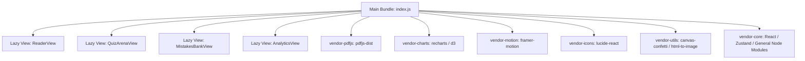

# 📖 منصة الرحيق المختوم — التوثيق التقني والمعماري الشامل
> **Al-Raheq Al-Makhtom Platform Architecture, Telemetry, Performance & Stack Documentation**

---

> [!NOTE]
> هذا الملف وثيقة مرجعية شاملة للبنية التحتية، التقنيات والمكتبات البرمجية، وآليات تحسين الأداء وإدارة البيانات لمنصة **الرحيق المختوم**.

---

## 🚀 1. التقنيات والمكتبات المستخدمة (Tech Stack & Dependencies)

تم بناء المنصة باستخدام أحدث التقنيات لضمان التوافق التام مع الشاشات، الأداء الفائق (60FPS)، والوصول الشامل (Accessibility 100%).

| التصنيف | المكتبة / التقنية | الإصدار | الغرض والاستخدام في المنصة |
| :--- | :--- | :--- | :--- |
| **Core Framework** | `React` | `^19.0.0` | الإطار الأساسي لبناء واجهة المستخدم التفاعلية |
| **Language** | `TypeScript` | `^5.7.3` | بناء كود موثوق بعيد عن الأخطاء مع النمذجة الإستاتيكية |
| **Build Tool** | `Vite` | `^6.1.0` | محرك البناء والتجميع فائق السرعة مع الدعم لـ HMR |
| **State Management**| `Zustand` | `^5.0.3` | إدارة حالة التطبيق الشاملة (الصفحة الحالية، الأسئلة، الأوسمة، المظهر) |
| **UI Design System** | `Tailwind CSS` | `^3.4.17` | نظام التنسيق مع تطعيمه بقواعد Material Design 3 (M3) |
| **Animations** | `Framer Motion` | `^12.4.7` | تحريك الانتقالات والنوافذ المنبثقة بكفاءة GPU عالية |
| **PDF Renderer** | `pdfjs-dist` | `^4.10.38` | القارئ التفاعلي لملف PDF الخاص بكتاب الرحيق المختوم |
| **Data Analytics** | `Recharts` | `^2.15.1` | الرسم البياني التفاعلي لإحصائيات تقدم القارئ والإجابات |
| **Iconography** | `Lucide React` | `^0.475.0` | حزمة الأيقونات العصرية والمتوافقة مع الشاشات عالية الدقة |
| **Database** | `@supabase/supabase-js`| `^2.48.1` | الربط بقاعدة بيانات PostgreSQL لحفظ التقدم في السحابة |
| **Analytics (GA4)** | `Google Analytics 4` | `gtag.js` | تتبع الزيارات وأحداث القراءة والاختبارات (`G-F9RSXHRTBC`) |
| **Analytics (Vercel)**| `@vercel/analytics` | `^1.5.0` | تتبع زوار منصة Vercel وتحليلات الأداء لحظياً |
| **Telemetry** | `Telegram Bot API` | `Fetch API` | إرسال تنبيهات الزوار الجدد وتلقي الرسائل عبر التلغرام |
| **Export Utilities**| `html-to-image` | `^1.11.13` | تحويل كروت الإنجاز والإهداء إلى صور PNG عالية الدقة |
| **Celebrations** | `canvas-confetti` | `^1.9.4` | تأثيرات الألعاب النارية الاحتفالية عند فتح الأوسمة وختم الكتاب |
| **SEO & Head** | `react-helmet-async` | `^3.0.0` | إدارة الوسوم الميتا والعناوين ديناميكياً لتوافق محركات البحث |

---

## 📊 2. هيكلية تقسيم الحزم والتحميل الديناميكي (Code Splitting)

تم ضبط إعدادات `vite.config.ts` لتقسيم الكود يدويًا (`manualChunks`) إلى حزم صغيرة ومستقلة، مع التحميل المتأخر (`React.lazy`) لكافة الشاشات الثقيلة:



---

## ⚡ 3. استراتيجية الأداء العالي (Lighthouse 95+ Score)

> [!TIP]
> جميع الخدمات الخارجية والأحداث غير الحرجة يتم تأجيلها باستخدام `requestIdleCallback` لمنع إعاقة المسار الحرج للتحميل المبدئي (Critical Rendering Path).

### 🛠️ التحسينات المطبقة:
1. **تأخير سكربتات التتبع (GTM / GA4 / Vercel Analytics):**
   تتأجل عملية حقن السكربتات لـ `3500ms` أو لحين خمول وحدة المعالجة المركزية للمتصفح.
2. **GPU-Accelerated CSS Animations:**
   استبدال أنميشن الخلفيات المتحركة التي تعتمد على `background-position` بخصائص متوافقة مع محرك كرت الشاشة (`transform: scale()` و `opacity` مع `will-change`).
3. **توليد الكروت عبر Canvas المباشر:**
   استخدام الـ HTML Canvas المباشر بدلاً من قراءة DOM لسرعة تفوق 500% في توليد صور الإهداء.

---

## ♿ 4. هيكلية الوصول الشامل (Accessibility 100%)

تم التدقيق الهيكلي لكافة العناصر التفاعلية لضمان التوافق التام مع قارئات الشاشة (Screen Readers):

> [!IMPORTANT]
> يمتلك كل عرض (View) عنصر `<h1>` فريد ورئيسي على مستوى الصفحة، مع تسلسل هرمي دقيق للعناوين الفائقة والفرعية (`<h1>` 👈 `<h2>` 👈 `<h3>`).

* **`HomeView`:** `<h1>` للعنوان الرئيسي للمنصة.
* **`ReaderView`:** `<h1> sr-only` لقارئ السيرة النبوية.
* **`QuizArenaView`:** `<h1>` لمنظومة الاختبارات التفاعلية.
* **`MistakesBankView`:** `<h1>` لأرشيف ومراجعة الأخطاء.
* **`AnalyticsView`:** `<h1>` لرتبة القارئ وإحصائياته.
* **النوافذ المنبثقة (`Modals`):** تبدأ دائماً بـ `<h2>` للعنوان الرئيسي وتتدرج إلى `<h3>` للأقسام الداخلية.

---

## 🔒 5. خدمات التتبع وحفظ البيانات (Telemetry & Storage)

````carousel
```typescript
// Google Analytics 4 Telemetry Integration
export function initGoogleAnalytics() {
  if (typeof window === 'undefined' || !GA_MEASUREMENT_ID) return;
  
  const loadScript = () => {
    const script = document.createElement('script');
    script.src = `https://www.googletagmanager.com/gtag/js?id=${GA_MEASUREMENT_ID}`;
    document.head.appendChild(script);
  };

  if ('requestIdleCallback' in window) {
    window.requestIdleCallback(() => loadScript(), { timeout: 3500 });
  } else {
    setTimeout(loadScript, 2500);
  }
}
```
<!-- slide -->
```typescript
// Supabase Cloud Progress Persistence
export async function syncUserProgressToSupabase(record: UserProgressRecord) {
  if (!SUPABASE_URL || SUPABASE_URL.includes('xyzcompany')) return;

  await supabase.from('alraheeq_progress').upsert({
    user_id: getUserId(),
    current_page: record.current_page,
    answered_questions_count: record.answered_questions_count,
    correct_answers_count: record.correct_answers_count,
    streak_days: record.streak_days,
    updated_at: new Date().toISOString(),
  });
}
```
<!-- slide -->
```typescript
// Telegram Telemetry Notification
export async function trackNewVisitorSession() {
  const message = `🔔 *زيارة جديدة للمنصة*\n📱 الجهاز: ${getDeviceType()}\n🌐 المسار: ${window.location.pathname}`;
  await fetch(`https://api.telegram.org/bot${BOT_TOKEN}/sendMessage`, {
    method: 'POST',
    headers: { 'Content-Type': 'application/json' },
    body: JSON.stringify({ chat_id: CHAT_ID, text: message, parse_mode: 'Markdown' })
  });
}
```
````

---

> **تم إعداد هذا التوثيق ليكون مرجعاً تقنياً كاملاً لمنصة الرحيق المختوم — تطوير: محمد أيمن (Mohamed Ayman)** ✨
